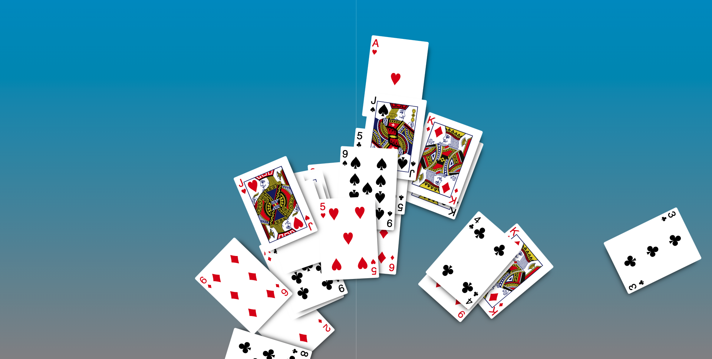

# Day One Project

## Goal



<hr>

## Start-up and Installation

1. Visit [tc-cards](https://github.com/Bryantellius/tc-cards.git)
2. Fork the repository
3. Click the green _Code_ button, and copy the clone url
4. Open your terminal or Git Bash
5. If you already have a _repos_ folder:

   ```sh
   $ cd repos
   ```

   or if you need to create a _repos_ folder:

   ```sh
   mkdir repos
   cd repos
   ```

6. Use git to clone the repository from Github

   ```sh
   git clone <url_from_github>
   ```

7. Install the dependencies and start the server.

   ```sh
   $ cd tc-cards
   $ npm install
   ```

<hr>

## Steps to Completion

### Creating the table connection

1. Open js/table.js in your editor
2. Find where socket.emit() accepts a string 'table-connect'
3. The method's second parameter accepts the unique table id
4. Replace 'id123' with the variable 'tableId' to pass in the correct table id to the server for connection

### Displaying the QR Code

1. Open js/table.js in your editor
2. Find where VSCode is signalling an error in your JS syntax
3. The method for creating a qr code is incorrect. Change the method to 'qrCodeGenerator'

### Creating the deck connection

1. Open js/deck.js in your editor
2. Find where "serverURL" (a string) is passed into the io.connect() method
3. Replace the string with the variable serverURL (without quotes) in order for socket.io-client to connect with the server

### Correcting the card throw strength property

1. Open js/deck.js in your editor
2. Find where 0 is assigned the value for 'strength'
3. Replace 0 with 'strength' (not in quotes) to assign the value from the _strength_ parameter to the _strength_ property for each card

<hr>

## Running the Project

- To run the project after you fixed the changes, open your terminal and run:

```sh
npm run start
```

- Enjoy!
